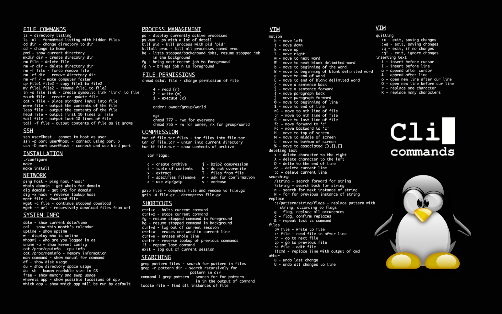
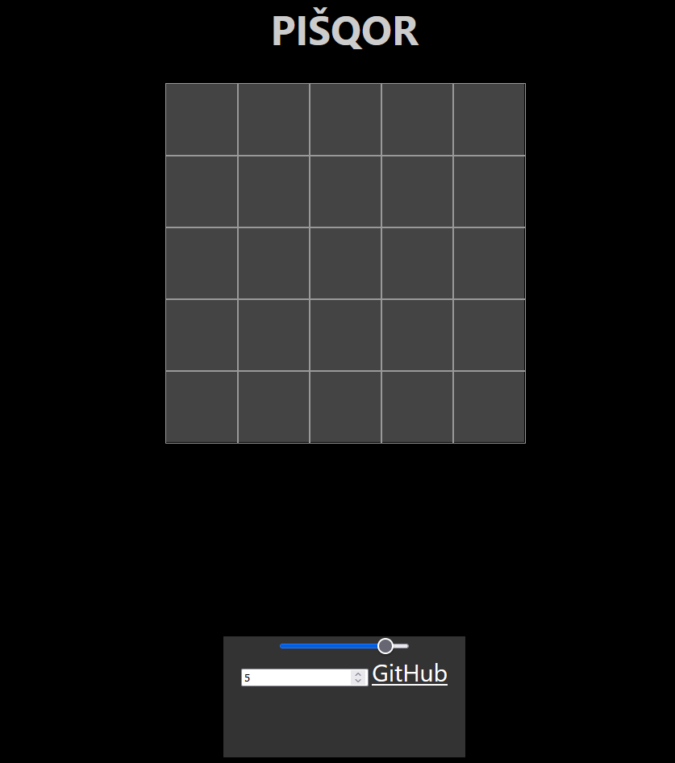

# Welcome to my GitHub profile!

## About me
My name is David Bednárek, I am from Czech Republic and I am currently a 19 year old student at VŠB-TUO in Ostrava where I study computer science. At the end of my study I expect to be an advanced programmer languages C and C++.

I often work on projects alone but I fancy working with other people in a team.

### Programming language skills
| Beginner    | Intermediate   | Advanced   |
|-------------|----------------|------------|
| C           | JavaScript     | Java       |
| Haskell     | PHP            | Rust       |
|             | Python         |            |

### Other skills
- SQL databases
- Linux based operating systems
- Basic networking skills
- Intermediate to advanced Unreal Engine 4 and 5 game development.

## Languages I can speak
-  Czech (native)
-  English (fluent)

I am a holder of B2 (formerly FCE) Cambridge certificate

## My personally favourite programming projects
### [JC-server](https://github.com/jantar1154/JC-server)
This is a program acting as a server for my upcoming chatting app. It is implemented entirely in Rust programming language and is still in the early stages of development. I chose to divide this project into two parts (server and client) so that a 3rd party client can be created.

### [PISHQOR](https://github.com/jantar1154/PISHQOR)
This little web-based Tic Tac Toe game I made while very simple in nature, I enjoyed developing it and I am fond of the idea and see a lot of potential in it.

## Contact me!
Feel free to contact me about literally anything:
-  My e-mail address (davidbednarek@email.cz)
-  Or DM me on Discord (jantar1154).
- *LinkedIn is still in progress*
