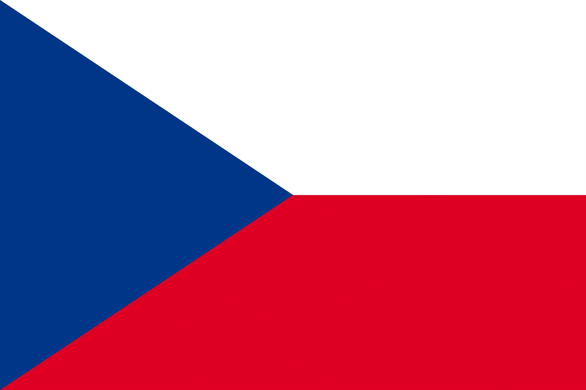

# Welcome to my GitHub profile!

## About me
Hello! My name is David Bednárek, a computer science student at VŠB-TUO in Ostrava.

During my time at the university, I developed a fondness for low level programming and I want to do more of it in the future.

When I am not coding *(mostly on my private repositories)*, I spend my free time playing video games or watching moves or tv shows. \
I'd like to make programming more than a free time activity, and wish to expand my knowledge in the field. \
While I enjoy learning about many different areas of software development, I am not particularly fond of AI. \
My projects are mostly a solo work, however I often brainstorm the ideas with my friends and find that it is better to work on a project with a team.

### Programming language skills
| Beginner    | Intermediate   | Advanced   |
|-------------|----------------|------------|
| Python      | Rust           | C          |
| Javascript  | C#             |            |
|             | C++            |            |

### Other skills
- Proficient in SQL language (MSSQL, Oracle)
- Strong understanding of Linux based operating systems
- Basic networking experience
- Intermediate knowledge of Unreal Engine 4 and 5 game development.

## Languages I can speak
-  Czech (native)
-  English (fluent)

**I'm certified with B2 (FCE) Cambridge English certificate**

## Goals
- I wish to become very proficient in Rust programming language, which piqued my interest after attending a voluntary Rust class at my university. I can see myself creating really cool project in it.
- I'd like to learn something about unit tests. I think it would improve the quality of my code a lot.
- I would like to do Advent of Code this year
- Explore some popular front-end frameworks, for example React or Angular

## Contact me!
Feel free to reach out for literally anything! Can't promise I will respond quickly though! \
I am most likely to respond.
-  My e-mail address (davidbednarek@email.cz)
-  Or DM me on Discord (jantar1154).
- [LinkedIn](https://www.linkedin.com/in/david-bedn%C3%A1rek-23b76425b/)
